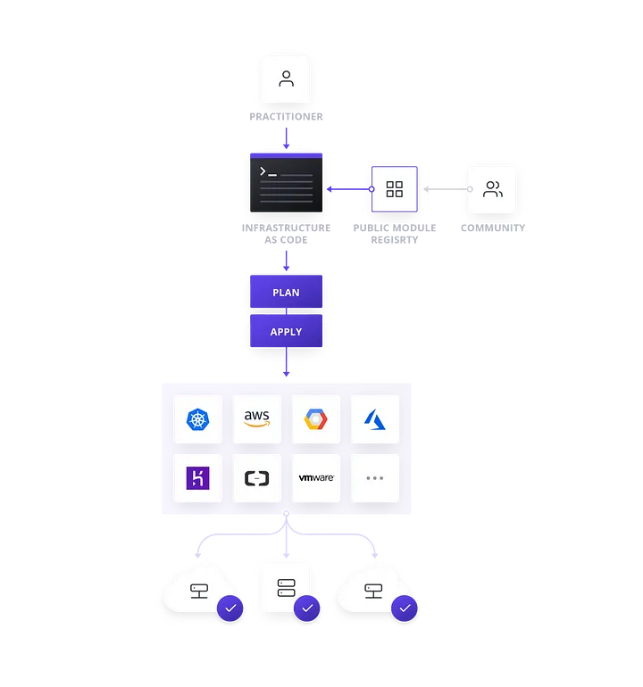

## IT运维自动化及其工具介绍

### Intrduce of IT Operations Automation and Related Tools
 
 

##### 主讲人 
Windom

---

## IT运维的对象 The componenet of IT Opterations

---
## 从资源使用的角度看云架构的演进
The cloud architectural evolution from a resource utilization point of view

---
## 机房动力环境监控 Data Center components monitoring

动力：市电、电源、蓄电池、UPS、发电机等
环境：温湿度、烟雾、漏水、门禁、视频等
监控：遥测、遥信、遥控、遥调

---

## 网络 Network

零配置部署 
Zero Touch Provisioning(ZTP)

aka：配置路由器

---
## 裸金属 Bare Metal → 主机系统/虚拟化层 Host OS/Hyperversion

aka：装电脑，把系统镜像写入硬盘

---

Ventoy

---

Canonical MAAS

--- 
### 虚拟化层 Hyperversion → 虚拟机镜像 VM Image
Hashicorp Packer
workflow

---
Hashicorp Packer
build process

---
### 虚拟机镜像 VM Image → 虚拟机实例 VM Instance
Hashicorp Terraform

---
Terraform workflow
