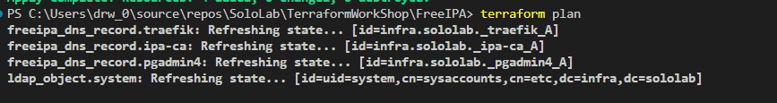

download from proxy when running `terraform init`
```powershell
$env:http_proxy="127.0.0.1:7890"
$env:https_proxy="127.0.0.1:7890"
terraform init
```

remove local state  
ref:   
  - [How can I remove a resource from terraform state?](https://stackoverflow.com/questions/61297480/how-can-i-remove-a-resource-from-terraform-state)
```powershell
terraform state list
terraform state rm freeipa_dns_record.traefik
```

import resource to terraform  
ref:  

```powershell
$ADDR="ldap_object.system"
$ID="uid=system,cn=sysaccounts,cn=etc,dc=infra,dc=sololab"
terraform import $ADDR $ID
```
